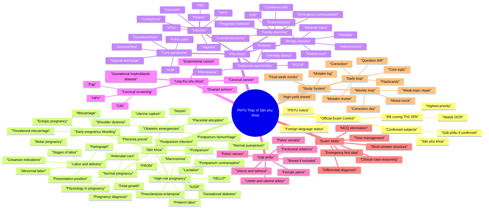

# PNTU Thạc sĩ Sản phụ khoa - Knowledge Mind Map

This mind map is for the learner and any AI teacher reading the repository. It organizes the Sản phụ khoa entrance-test knowledge into exam-ready domains.

## Mermaid Mind Map

## Source-To-Knowledge Map

| Knowledge Area | Primary Converted Sources |
|---|---|
| Sản cơ bản and broad MCQs | `converted-md/san-phu-khoa/__PNT_ TN4000 câu Sản Cơ bản.md` |
| Core Sản phụ khoa reading | `converted-md/san-phu-khoa/SPK cơ bản _1_.md` |
| Disease and high-risk pregnancy | `converted-md/san-phu-khoa/SPK Bệnh _1_.md` |
| PNT-style recent recall questions | `converted-md/san-phu-khoa/sản ck1 pnt 2026.md` |
| Supporting obstetric reference | `converted-md/san-phu-khoa/Sản Huế.md` |
| Anatomy recall | `converted-md/giai-phau/gp nhớ lại _1_.md` |
| Anatomy MCQ drill | `converted-md/giai-phau/Trắc nghiệm Giải Phẫu - GS Nguyễn Quang Quyền.md` |
| Official SPK outline | `converted-md/san-phu-khoa/Đề cương ôn thi ThS SPK.md`, needs OCR |
| Official anatomy outline | `converted-md/giai-phau/De cuong on thi Giai phau.md`, needs OCR |

## How an AI Teacher Should Use This Mind Map

- Start from the learner's weakest branch.
- Teach one branch at a time.
- Always connect a diagnosis to: definition, symptoms, tests, differential diagnosis, treatment principle, and emergency red flags.
- For every wrong MCQ, attach it to one branch in this mind map.
- In the final week, study only branches with repeated mistakes or official-outline priority.
