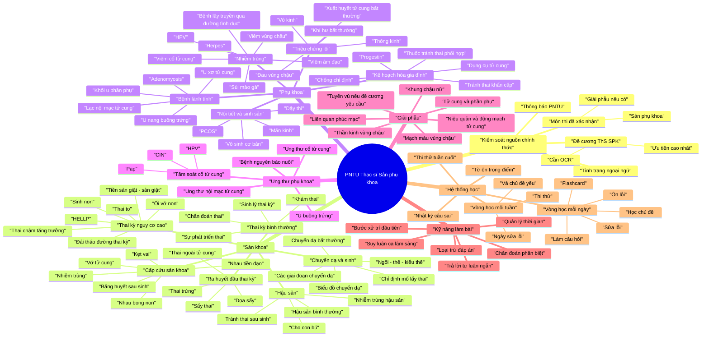

# PNTU Thạc sĩ Sản phụ khoa - Sơ đồ tư duy kiến thức

File này giúp người học và AI giáo viên nhìn toàn bộ kiến thức theo nhánh. Khi người học sai câu nào, hãy gắn câu sai đó vào đúng nhánh trong sơ đồ này.

## Sơ đồ Mermaid

## Bản đồ nguồn tài liệu

| Mảng kiến thức | Nguồn chính đã chuyển đổi |
|---|---|
| Sản cơ bản và câu hỏi rộng | `converted-md/san-phu-khoa/__PNT_ TN4000 câu Sản Cơ bản.md` |
| Lý thuyết Sản phụ khoa nền tảng | `converted-md/san-phu-khoa/SPK cơ bản _1_.md` |
| Bệnh học và thai kỳ nguy cơ cao | `converted-md/san-phu-khoa/SPK Bệnh _1_.md` |
| Câu hỏi nhớ lại/PNT gần đây | `converted-md/san-phu-khoa/sản ck1 pnt 2026.md` |
| Tài liệu Sản tham khảo | `converted-md/san-phu-khoa/Sản Huế.md` |
| Giải phẫu nhớ lại | `converted-md/giai-phau/gp nhớ lại _1_.md` |
| Trắc nghiệm Giải phẫu | `converted-md/giai-phau/Trắc nghiệm Giải Phẫu - GS Nguyễn Quang Quyền.md` |
| Đề cương SPK chính thức | `converted-md/san-phu-khoa/Đề cương ôn thi ThS SPK.md`, cần OCR |
| Đề cương Giải phẫu | `converted-md/giai-phau/De cuong on thi Giai phau.md`, cần OCR |

## Cách AI giáo viên dùng sơ đồ này

- Bắt đầu từ nhánh yếu nhất của người học.
- Mỗi buổi chỉ dạy một nhánh chính hoặc một nhánh con.
- Mọi bệnh cần đi qua: định nghĩa, triệu chứng, cận lâm sàng, chẩn đoán phân biệt, nguyên tắc xử trí, dấu hiệu nguy hiểm.
- Mỗi câu sai phải gắn vào một nhánh trong sơ đồ.
- Tuần cuối chỉ ôn nhánh có lỗi lặp lại hoặc nhánh chắc chắn nằm trong đề cương chính thức.
